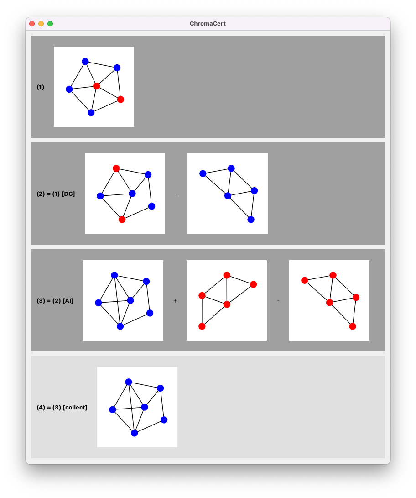

# ChromaCert – Certificates for Chromatic Equivalence

(c) 2023 by Harald Bögeholz

This software provided under an MIT license. See the file LICENSE for details.

## Prerequisites

* Download and install the latest Python 3 from https://python.org (ChromaCert was developed using Python 3.11 under macOS)
* `pip3 install matplotlib numpy sympy networkx pyqt5`

## Running the program

`python3 chromacert.py`

## (No) Documentation

This project is in a very early stage of development. Not all intended functions are implemented 
and there is no documentation yet. Most of the functionality is in context menus.
Try right clicking on graphs, row labels, operands, parentheses ... it is hopefully somewhat self-explanatory
(for someone who knows about chromatic polynomials of graphs).

Click on things labelled "DEBUG" or "Test" at your own risk. Who knows what they might do
today, and they might do something else a few hours later ;-). Also, they might crash the program.

Here's a screenshot:

## References

1. Kerri Morgan, Graham Farr: Certificates of Factorisation for Chromatic Polynomials. The Electronic Journal of Combinatorics, Volume 16, Issue 1 (2009). DOI: [10.37236/163](https://doi.org/10.37236/163)
2. Zoe Bukovac, Graham Farr, Kerri Morgan: Short certificates for chromatic equivalence, Journal of Graph Algorithms and Applications 2019, DOI: [10.7155/jgaa.00490](https://dx.doi.org/10.7155/jgaa.00490)
